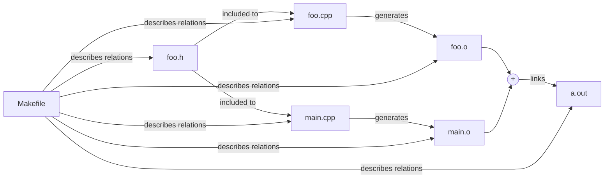

# Make

The project describes how to write a *Makefile-based* project that consist of several files.

## Files of the project

The project consists of the following files:
 - *Makefile* - describes dependencies in the project and rules, and
   commands to assemble the project
 - *main.cpp* - entry file, keeps main() function
 - *foo.h* - declaration of the Foo class
 - *foo.cpp* - definition of the Foo class

## Building the project

The following steps should be make in order to obtain and build the project:
 - clone the repository launching the command: `git clone https://github.com/lktrgl/Make.git`
 - run `make clean`to clean the temporary files up
 - run `make all` to assemble the project

## File relations and dependencies

